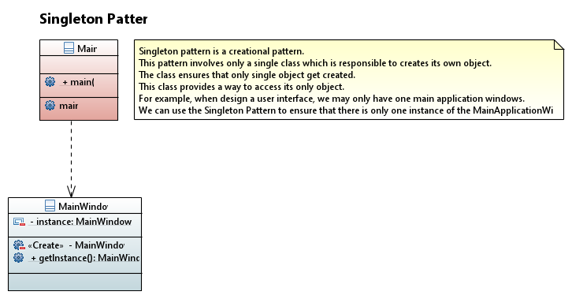
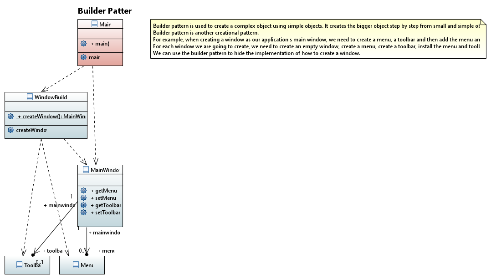
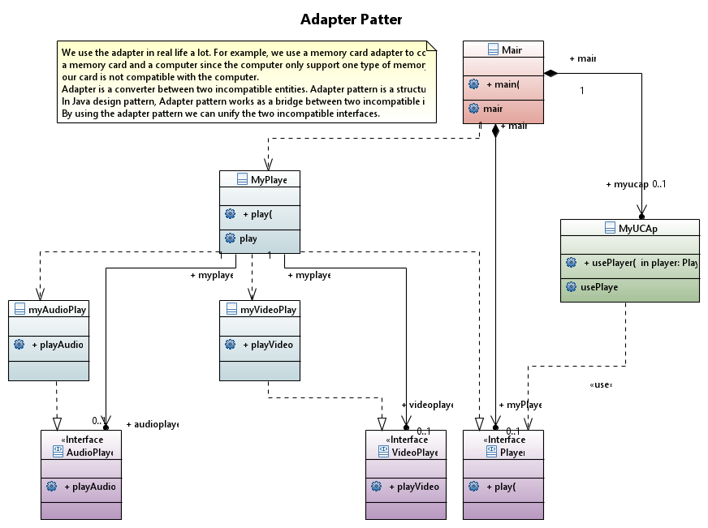
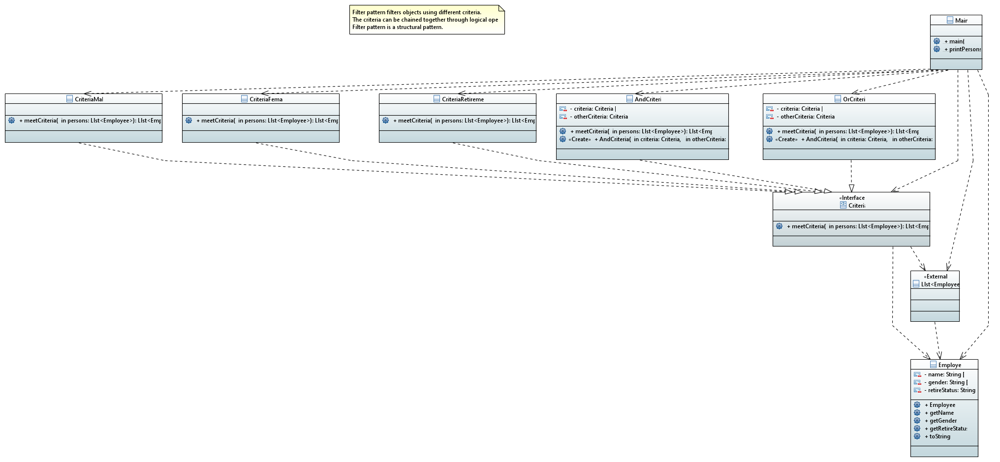
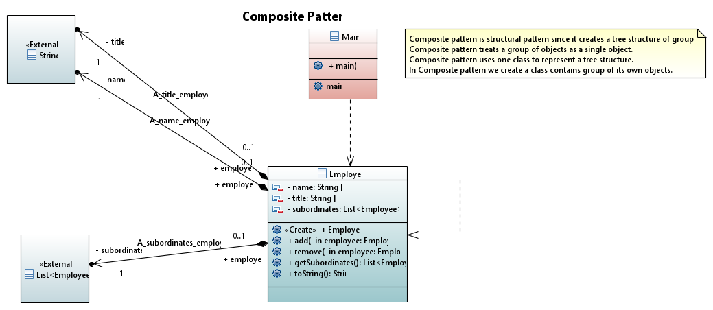
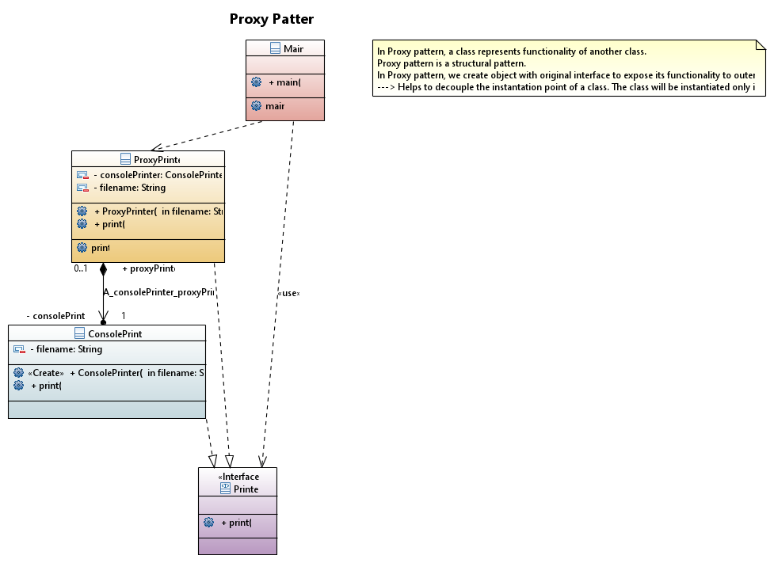
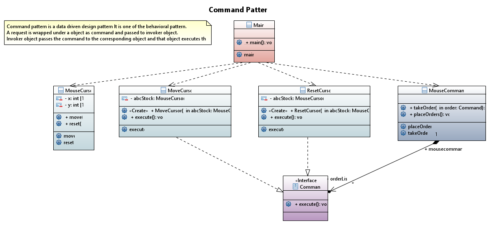

# Design Patterns

This folder contains the 24 most famous design patterns.

They have been modeled in Papyrus and reproduce the examples found in [java2s.com](http://www.java2s.com/Tutorials/Java/Java_Design_Patterns/0100__Java_Decorator_Pattern.htm) 

The examples show how to implement the patterns mainly in JAVA!

They are three kind of patterns:

* Creational Patterns
* Structural Patterns
* Behavioral Patterns

## 1. Creational Patterns

### 1.1 Factory Pattern

### 1.2 Abstract Factory Pattern

### 1.3 Singleton Pattern

### 1.4 Builder Pattern

### 1.5 Prototype Pattern

## 2. Structural Patterns
### 2.1 Adapter Pattern

### 2.2 Bridge Pattern

### 2.3 Filter Pattern

### 2.4 Composite Pattern

### 2.5 Decorator Pattern

### 2.6 Facade Pattern

### 2.7 Proxy Pattern

## 3. Behavioral Patterns
### 3.1 Chain of Responsability Pattern

### 3.2 Command Pattern

### 3.3 Iterator Pattern
### 3.4 Observer Pattern
### 3.5 Mediator Pattern
### 3.6 Interpreter Pattern 
### 3.7 State Pattern
### 3.8 Null Object Pattern 
### 3.9 Strategy Pattern
### 3.10 Template Pattern
### 3.11 Visitor Pattern
### 3.12 MVC Pattern

## 4. JEE Design Patterns
### 4.1 Java Data Access Object Pattern